Bitcoin / Cryptocurrency Market - Trend Regression
================

Simple trend regressions on bitcoin price data + total cryptocurrency and altcoin market capitalizations.

Latest Readme Update: 21 Jan. 2018

Bitcoin Price Data
==================

### Exponential Regression

``` r
source("config/Config.R")

Sys.setenv(tz="UTC")
btc.price <- FetchBTCInfo(param           = "market-price",   
                          data.identifier = "btc.close", 
                          date.start      = "2011-01-01")

par(mfrow=c(1, 1))
SimpleLogTrendRegression(data = btc.price, 
                         data.identifier = "BTC-price",
                         regression.type = "exponential",
                         nr.future=120, plot.2sd.log = TRUE, plot.2sd.levels = FALSE)
```

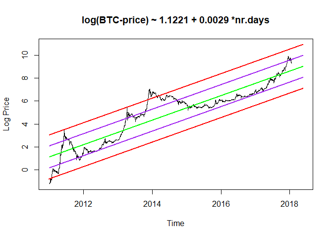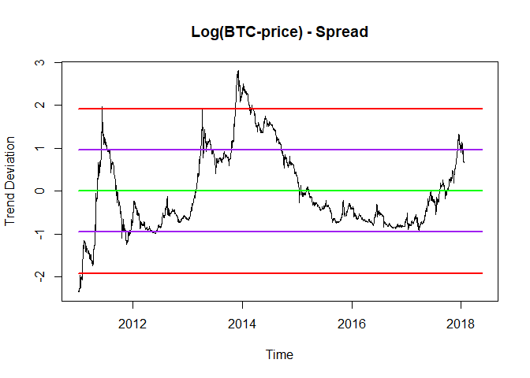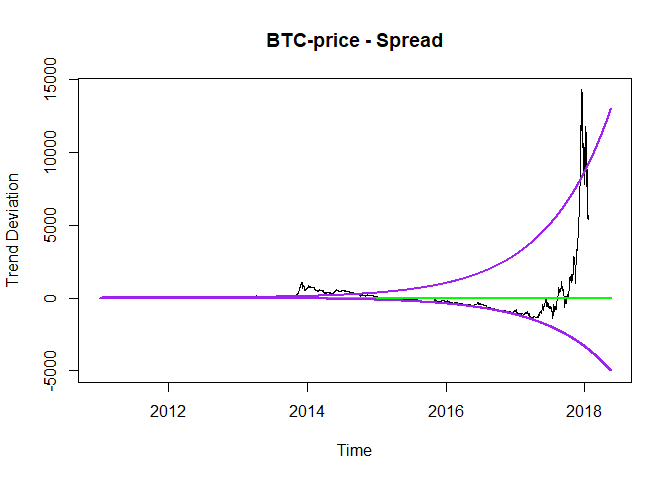

### Loess Regression

``` r
SimpleLogTrendRegression(data = btc.price, 
                         data.identifier = "BTC-price",
                         regression.type = "loess",
                         nr.future=120, plot.2sd.log = TRUE, plot.2sd.levels = TRUE)
```

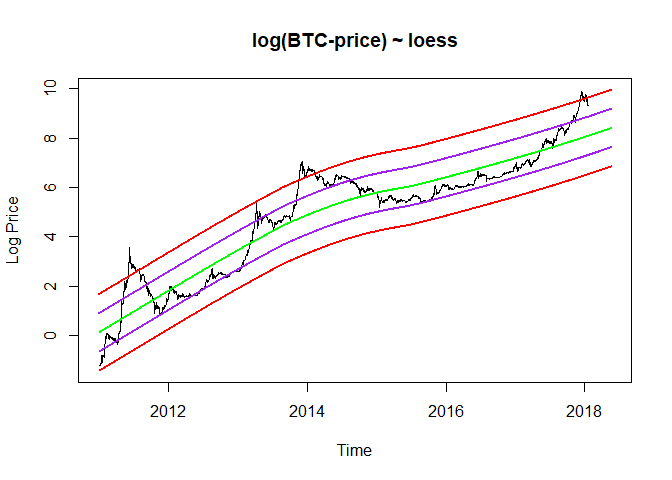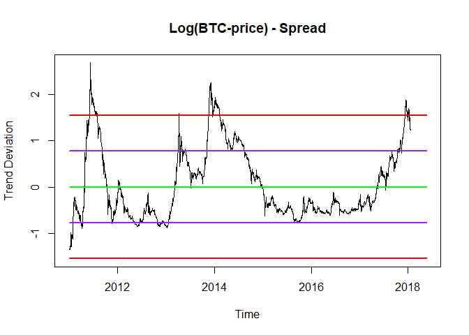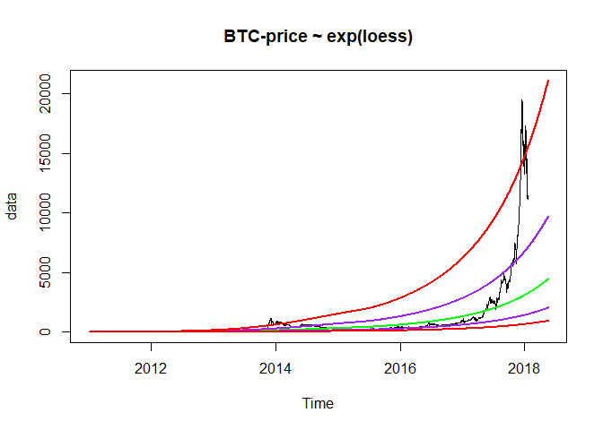

### Logarithmic Regression (on log data)

``` r
SimpleLogTrendRegression(data            = btc.price,
                         data.identifier = "BTC-price",
                         regression.type = "logarithmic",
                         nr.future=120, plot.2sd.log = TRUE, plot.2sd.levels = TRUE)
```

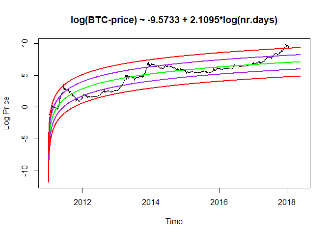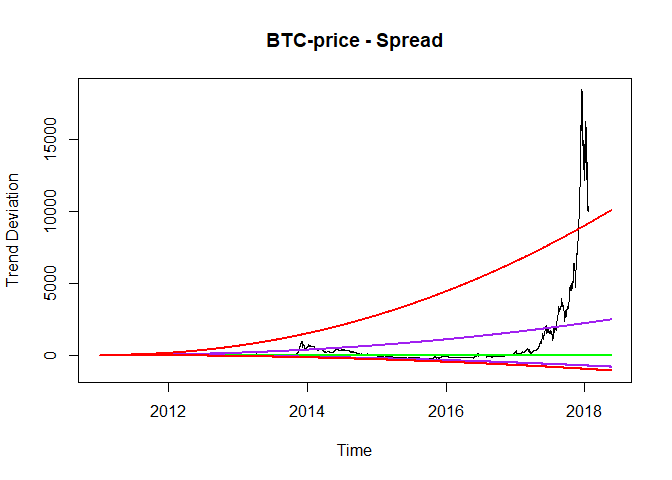

Cryptocurrency Market Capitalization (Total)
============================================

Note: The analysis below uses weekly historical data that was scraped from [coinmarketcap.com](https://coinmarketcap.com/) and only goes back to 2013-04-28. Suggestions for better data sources are appreciated..

### Exponential Regression

``` r
cryptocurrency.market.cap <- FetchCryptocurrencyMarketCapitalizations()
SimpleLogTrendRegression(data = cryptocurrency.market.cap$total,
                         data.identifier = "Total Cap", data.frequency = "weekly",
                         regression.type = "exponential",
                         nr.future       = 12, plot.2sd.log = TRUE, plot.2sd.levels = TRUE)
```

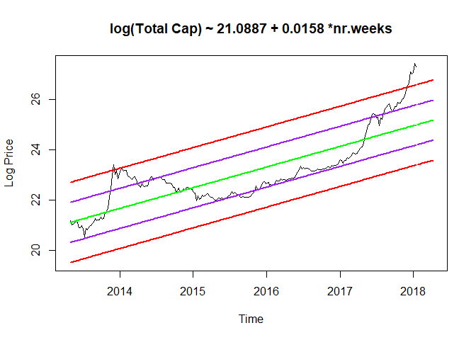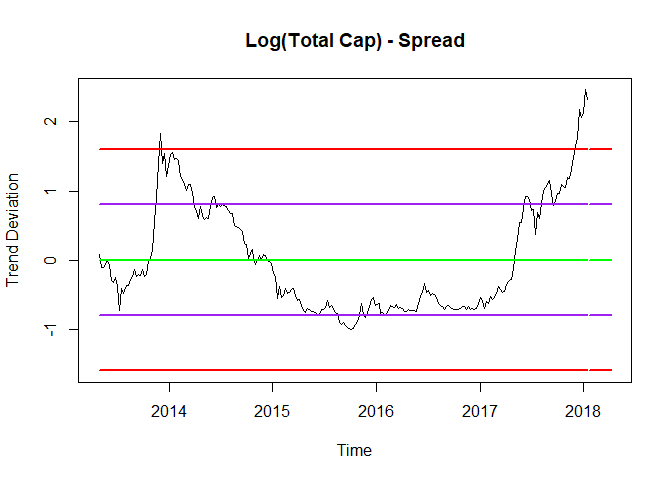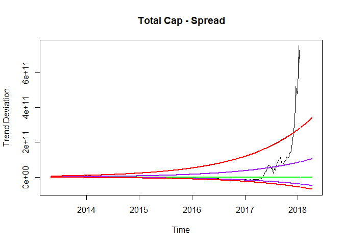

### Loess Regression

``` r
SimpleLogTrendRegression(data = cryptocurrency.market.cap$total,
                         data.identifier = "Total Cap", data.frequency = "weekly",
                         regression.type = "loess",
                         nr.future       = 12, plot.2sd.log = TRUE, plot.2sd.levels = TRUE)
```

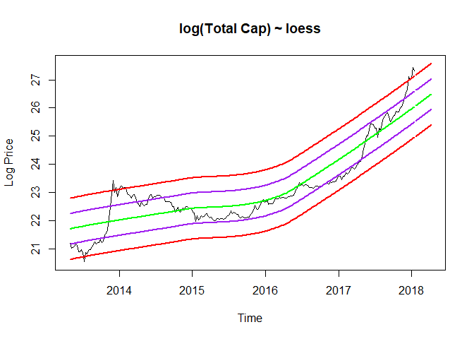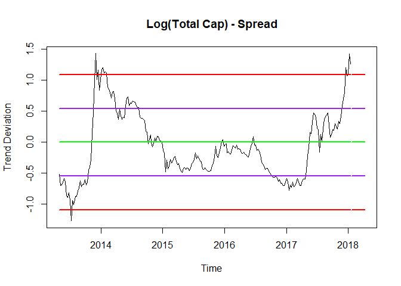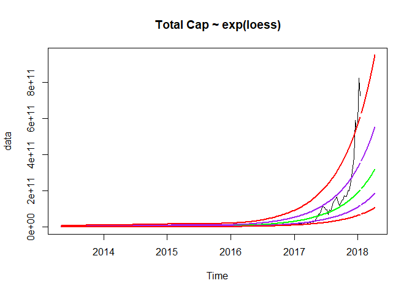

### Logarithmic Regression (on log data)

``` r
SimpleLogTrendRegression(data = cryptocurrency.market.cap$total,
                         data.identifier = "Total Cap", data.frequency = "weekly",
                         regression.type = "logarithmic",
                         nr.future       = 12, plot.2sd.log = TRUE, plot.2sd.levels = TRUE)
```

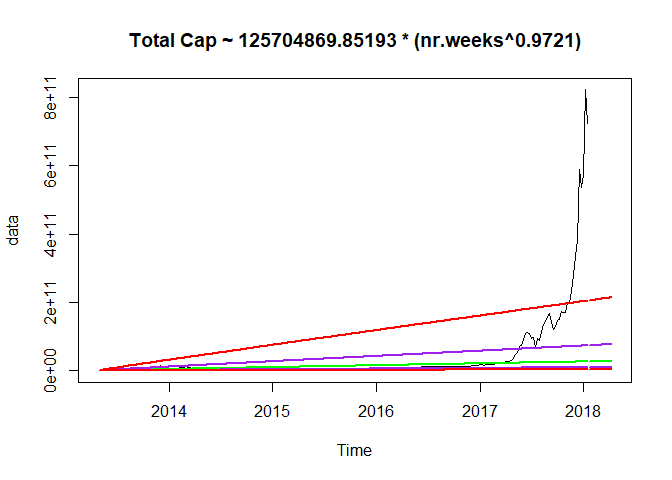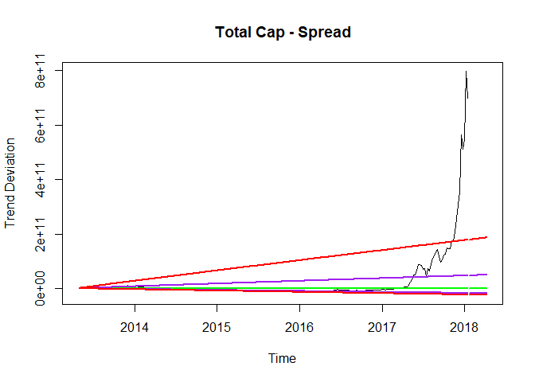

Cryptocurrency Market Capitalization (Altcoins)
===============================================

### Exponential Regression

``` r
SimpleLogTrendRegression(data = cryptocurrency.market.cap$alts,
                         data.identifier = "Alt Cap", data.frequency = "weekly",
                         regression.type = "exponential",
                         nr.future       = 12, plot.2sd.log = TRUE, plot.2sd.levels = TRUE)
```

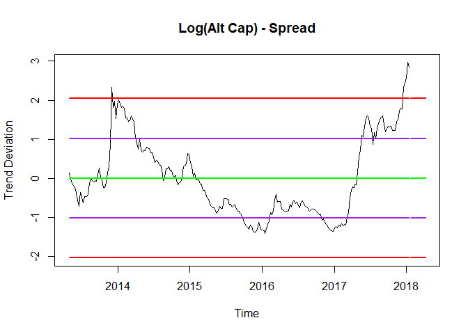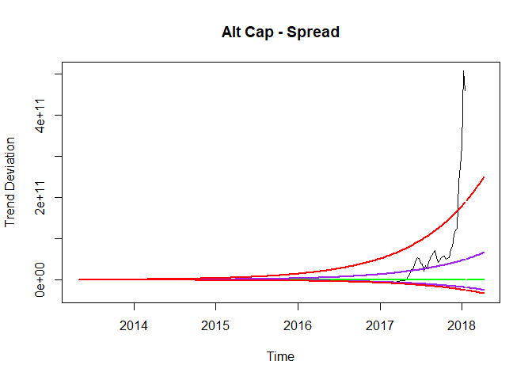

### Loess Regression

``` r
SimpleLogTrendRegression(data = cryptocurrency.market.cap$alts,
                         data.identifier = "Alt Cap", data.frequency = "weekly",
                         regression.type = "loess",
                         nr.future       = 12, plot.2sd.log = TRUE, plot.2sd.levels = TRUE)
```

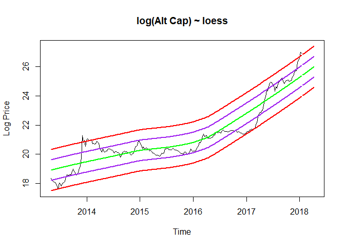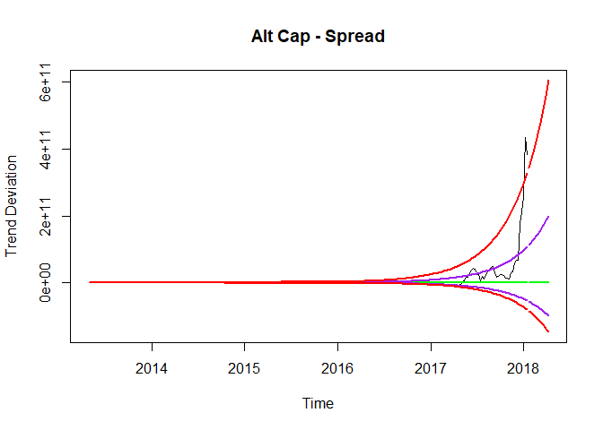

### Logarithmic Regression (on log data)

``` r
SimpleLogTrendRegression(data = cryptocurrency.market.cap$alts,
                         data.identifier = "Alt cap", data.frequency = "weekly",
                         regression.type = "logarithmic",
                         nr.future       = 12, plot.2sd.log = TRUE, plot.2sd.levels = TRUE)
```

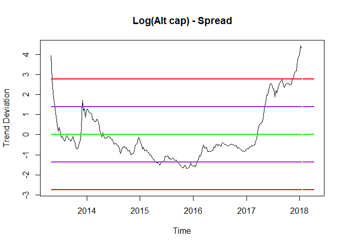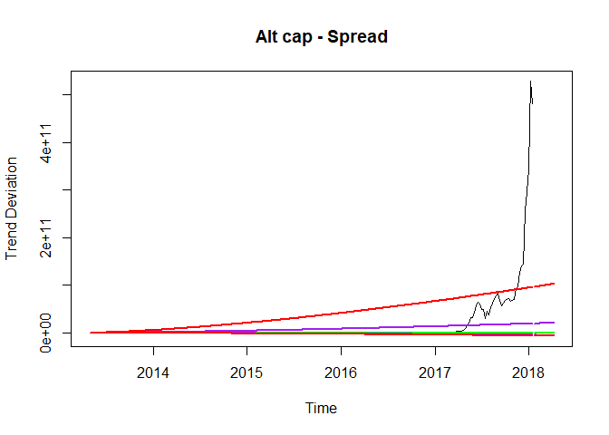

Donations
---------

If you find this software useful and/or you would like to see additional extensions, feel free to donate some crypto:

-   BTC: 1QHtZLZ15Cmj4FPr5h5exDjYciBDhh7mzA
-   LTC: LhKf6MQ7LY1k8YMaAq9z3APz8kVyFX3L2M
-   ETH: 0x8E44D7C96896f2e0Cd5a6CC1A2e6a3716B85B479
-   DASH: Xvicgp3ga3sczHtLqt3ekt7fQ62G9KaKNB

Licensing
---------

Copyright 2017 Essential Data Science Consulting ltd. ([EssentialQuant.com](http://essentialquant.com "EssentialQuant") / <jellenvermeir@essentialquant.com>). This software is copyrighted under the MIT license: View added [LICENSE](./LICENSE) file.
